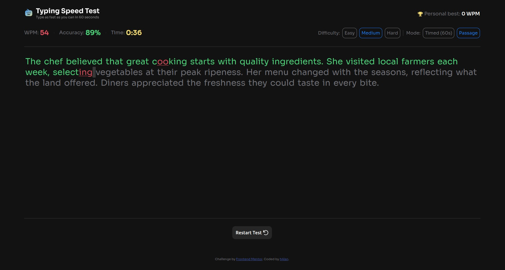

# Frontend Mentor - Typing Speed Test solution

This is a solution to the [Typing Speed Test challenge on Frontend Mentor](https://www.frontendmentor.io/challenges/typing-speed-test). Frontend Mentor challenges help you improve your coding skills by building realistic projects. 

## Table of contents

- [Overview](#overview)
  - [The challenge](#the-challenge)
  - [Screenshot](#screenshot)
  - [Links](#links)
- [My process](#my-process)
  - [Built with](#built-with)
  - [What I learned](#what-i-learned)
  - [Continued development](#continued-development)
  - [Useful resources](#useful-resources)
  - [AI Collaboration](#ai-collaboration)
- [Author](#author)
- [Acknowledgments](#acknowledgments)

**Note: Delete this note and update the table of contents based on what sections you keep.**

## Overview

### The challenge

Users should be able to:

- View the optimal layout for the interface depending on their device's screen size
- See hover and focus states for all interactive elements on the page

### Screenshot



### Links

The app isn't currently hosted, but you can download the source files and try it for yourself.

## My process

### Built with

- Semantic HTML5 markup
- CSS Flexbox, Grid and animations
- Vanilla JS

### What I learned

The main takeaway here would be all the CSS tricks I learned: I realized I was doing so much wrong - and a lot in this project still is to be honest - which is a feeling I love when coding.

I feel like the following CSS code sums up pretty much the way I experienced with flexbox and grid: I got confused a lot when I realized I could just combine both, and it led to pretty satisfying results. I still hesitate when deciding when to use one or the other, but I think a good rule of thumb is: one should use grid when wanting the container to define the position of the elements, whereas using flexbox allow the children to define their position.  

```css
body {
    /* For the sticky footer */
    min-height: 100%;
    display: flex;
    flex-direction: column;
    grid-template-rows: 1fr auto;

    /*...*/
}
```

I almost lost it trying to code the test logic (and I now get why all my classmate trash JS every second they get). I'm pretty proud of how I modeled it in the HTML: an invisible textarea in front of a \<p> element. I inserted every letter of the paragraph inside a span so I could edit every letter individually.

```js
checkModel(wasCharacterTyped) {
    const textModel = document.querySelector("#text-model")
    const textTyped = document.querySelector("#text-typed").value
    const nextCharIdx = textTyped.length

    if (nextCharIdx <= textModel.textContent.length) {
    // Remove the styling on the previous character and apply it onto the new one
      const previousChar = document.querySelector("#next-char")
      const nextChar = textModel.children[nextCharIdx]

      const typedChar = textTyped.charAt(nextCharIdx-1)

      // Resetting the next-char style
      previousChar.id = ""
      previousChar.classList.remove("correct", "incorrect")

      // Check if we just wrote or deleted
      if (previousChar.nextElementSibling === nextChar) { // if we just wrote...
        if (wasCharacterTyped) {
          this.typed++
        }
        // Check if the character corresponds
        if (typedChar === previousChar.textContent) {
          previousChar.classList.add("correct")
        } else {
          this.mistakes++
          this.mistakesPermanent++
          previousChar.classList.add("incorrect")
        }
      } else {
        if (nextChar.classList.contains("incorrect")) {
          this.mistakes--
        }
      }
      // Apply style to the next character to type 
      nextChar.classList.remove("correct", "incorrect")
      nextChar.id = "next-char"

      // Check if passage has ended
      this.passageEnd = nextChar.classList.contains("end-of-text")
    } else {
      this.passageEnd = true
    }
  }
```

I'm also pretty proud of the timer logic, and how I got the confetti animation to restart every time the \<dialog> opens again. 

### Continued development

The main thing I want to focus on during subsequent projects is modeling my app: its different states, the logic behind, using  a diagram. I feel like being able to think about the app before jumping into coding, would make it ten times easier to not get lost, especially when I get excited about an idea for a new functionality.

I really want to get into JS frameworks, especially Vue - since my friends convinced me so hard. And with that, I want to get better at writing JS clean code, just like experienced programmers do it. This means separating my code into key functions, only adding the necessary event listeners, and many other things I think I can pick up by reading open source code.

### Feedback Wanted

These are the main areas I would like feedback on, and questions I would like answers to, from the POV of a more experienced programmer than me. Thanks in advance.

For JS:
- Should I create functions directly in the global file and split the files into modules, instead of creating different objects just to hold methods or variables .
- Should I store data in different JS/JSON files? If so, is there a way to access the data in a local JSON file without putting in into a JS file?
- Is declaring global ``const`` elements a good practice (since it reduce the number of ``querySelector(...)`` calls) ?
- Is using the ``DOMContentLoaded`` rather than ``load`` always better (since the former waits only for all the elements of the **current** page to load)
- Is my code clean (enough), from the way I wrote functions inside objects to what each function/method holds ?

### Challenges encountered

These are a few steps during which I struggled. I would also like feedback/answers for me to use during my next project:

Where I did not find solutions:
- **Stopping the "Resume game" button from showing for a fraction of a second when the "Restart" button is clicked.** My guess is I would have to change when the "Resume game" overlay shows.
- **Customizing a dropdown menu for the settings in the mobile layout, using a \<select> element and supported CSS properties only.** My guess is I should not use \<select>, but a button showing/hiding a div, and style that div to look like the desired design.
- **Directly accessing data in the JSON file.** I put it directly in the script.js file.
- **Limiting the height of the page to only the screen: no overflow, no scroll bar if the text is too long.**
- **Changing the "Test Completed!" dialog box on a classic screen, to a fullscreen message on a mobile screen.**

Where I did solve the problem:
- **Game logic - removing the styles (color, underline) applied to characters that were deleted.** I solved it by using the ``event.data`` attribute, showing which key triggered the event. 
- **Preventing the using from selecting text with his mouse, or using shortcuts.**

### Useful resources

- [CSS Tricks guides](https://css-tricks.com/complete-guide-css-grid-layout/) - This helped me grasp how grid works pretty quickly, and works as a good cheat sheet.

### AI Collaboration

Describe how you used AI tools (if any) during this project. This helps demonstrate your ability to work effectively with AI assistants.

- I only used Gemini Pro
- I don't like using AI when learning such basic aspects of programming (here it would be vanilla JS): for me it's like using AI to learn how to talk, it sounds stupid. I prefer to pre-prompt it and limit it to behave like a better search engine: instead of googling something for 1 hour, I ask it a question and it gives me ressources without coding.

## Author

- Github - [h4lan](https://github.com/h4lan)
- Linkedin - [Halan Ouensanga](https://www.linkedin.com/in/halan-ouensanga/)

## Acknowledgments

Me, myself and I ;).